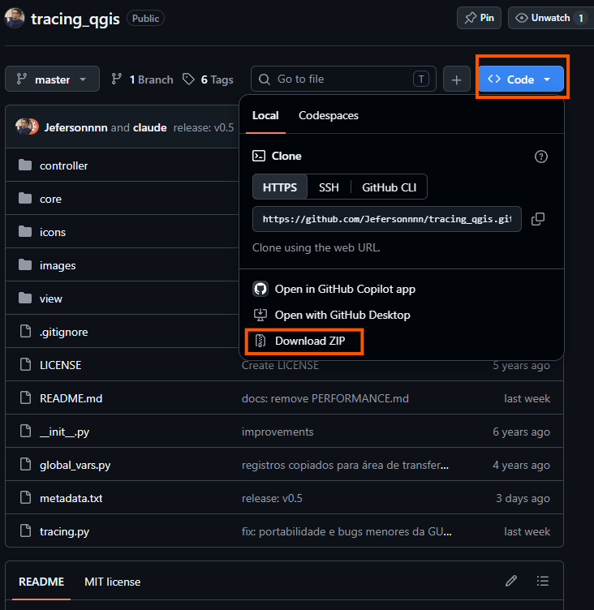
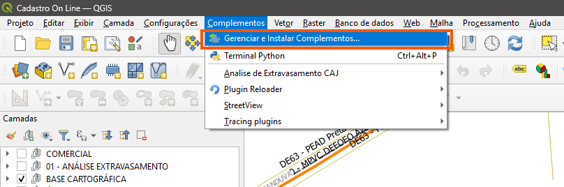
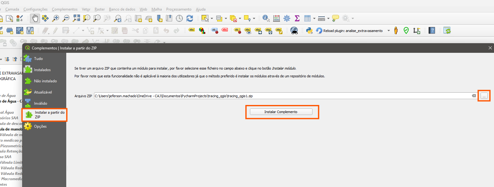
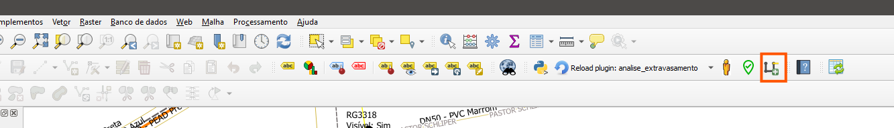
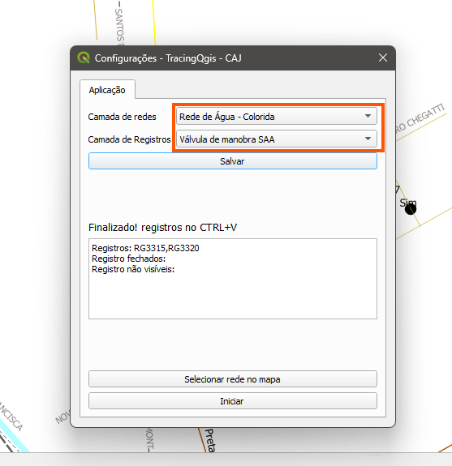
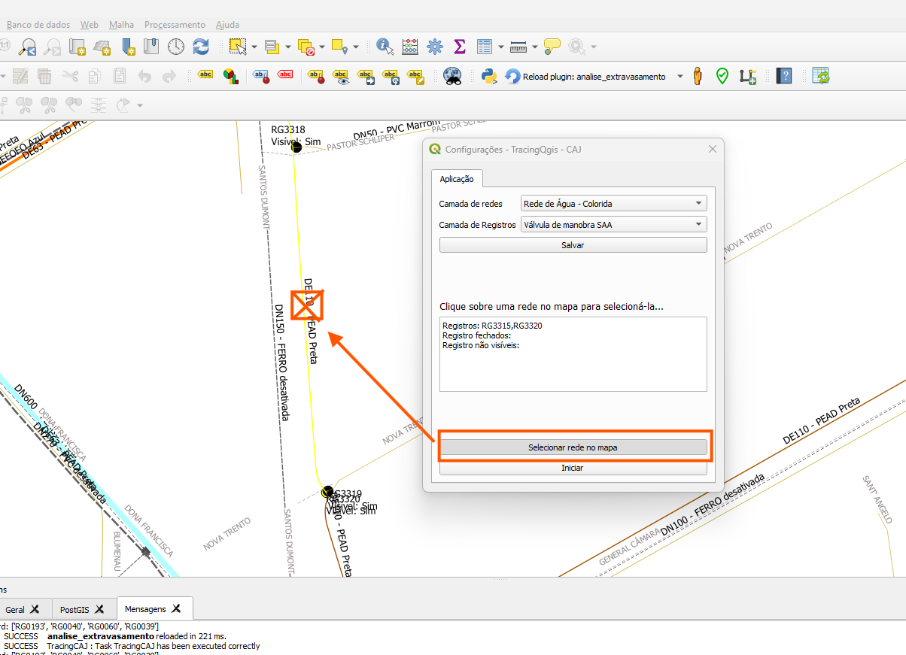
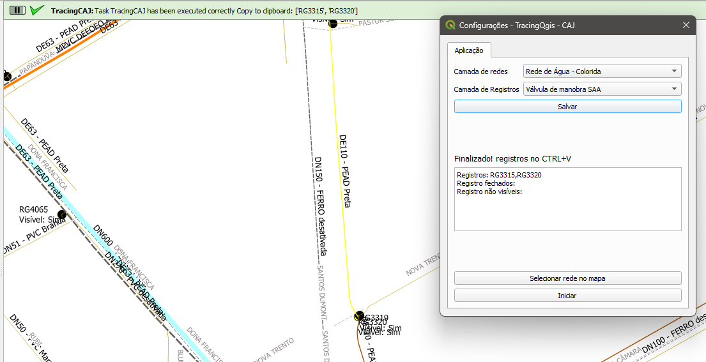

# Guia de Instalação e Uso — TracingQgis (CAJ)

Este guia é para quem vai **instalar e usar** o complemento TracingQgis no dia a dia,
sem precisar entender de programação. Siga os passos na ordem.

---

## O que esse complemento faz

Ao selecionar um trecho da rede de água no mapa, o plugin percorre a rede
automaticamente e informa **quais registros (válvulas) fechar** para isolar aquele
trecho — sem precisar fazer esse cálculo manualmente.

---

## Antes de começar

- QGIS instalado, versão **3.16 ou mais nova**. Se não tiver o QGIS, baixe em
  [qgis.org/download](https://qgis.org/download/).
- O projeto QGIS precisa ter carregadas a **camada de rede de água** (linhas) e a
  **camada de registros/válvulas** (pontos). Se não souber onde estão, pergunte ao
  responsável pelo GIS na sua equipe.

---

## Parte 1 — Instalação (só precisa fazer uma vez)

### Passo 1 — Baixar o plugin

1. Acesse: <https://github.com/Jefersonnnn/tracing_qgis>
2. Clique no botão verde **Code**.
3. Clique em **Download ZIP**.
4. Guarde o arquivo baixado (geralmente vai para a pasta **Downloads**). **Não é
   necessário descompactar o arquivo.**

*(captura da página do GitHub com o botão "Code" e "Download ZIP" visíveis)*

### Passo 2 — Abrir o gerenciador de complementos no QGIS

1. Abra o QGIS.
2. No menu superior, clique em **Complementos**.
3. Clique em **Gerenciar e Instalar Complementos...**

*(captura do menu "Complementos" aberto, com a opção "Gerenciar e Instalar
Complementos..." em destaque)*

### Passo 3 — Instalar a partir do ZIP

1. Na janela que abrir, clique em **Instalar a partir do ZIP** no menu da esquerda.
2. Clique no botão **...** e selecione o arquivo `.zip` baixado no Passo 1.
3. Clique em **Instalar Complemento**.
4. Se aparecer um aviso de segurança (complemento de terceiros), clique em **Sim** /
   **Instalar mesmo assim** para confirmar.

*(captura da aba "Instalar a partir do ZIP" com o caminho do arquivo já selecionado)*

### Passo 4 — Confirmar que instalou

Depois de instalar, confira:

- Um ícone novo aparece na barra de ferramentas do QGIS.
- No menu **Complementos**, aparece o item **Tracing plugins** (o texto está em
  inglês mesmo — é assim que o plugin foi nomeado, não é erro).

*(captura da barra de ferramentas com o ícone do TracingQgis em destaque)*

**Instalação concluída — isso só precisa ser feito uma vez por computador.**

---

## Parte 2 — Configuração inicial (só na primeira vez que for usar)

1. Clique no ícone do plugin na barra de ferramentas (ou **Complementos → Tracing
   plugins → Start Tracing** — o nome do botão também está em inglês).
2. Na janela **Configurações**, escolha:
   - **Camada de redes** → a camada de linhas da rede de água.
   - **Camada de Registros** → a camada de pontos das válvulas.
3. Clique em **Salvar**. Da próxima vez que abrir o plugin, essas camadas já vêm
   selecionadas automaticamente.

*(captura da janela de Configurações com as duas camadas já selecionadas e o botão
Salvar em destaque)*

---

## Parte 3 — Como usar (toda vez)

### 1. Selecione o trecho de rede que quer isolar

Existem duas formas — use a que preferir:

**Opção A — Clicando no mapa (mais simples)**

1. Na janela do plugin, clique em **Selecionar rede no mapa**.
2. Clique, no mapa, sobre o trecho de tubulação que deseja isolar.
3. A rede é selecionada automaticamente (fica destacada em amarelo/vermelho no mapa).

*(captura do botão "Selecionar rede no mapa" pressionado e um trecho da rede
destacado no mapa após o clique)*

**Opção B — Usando a seleção padrão do QGIS**

1. Ative a ferramenta de seleção do QGIS (ícone de seta com um quadrado, na barra de
   ferramentas do QGIS).
2. Clique sobre o trecho de tubulação no mapa para selecioná-lo.

> Importante: selecione **apenas um** trecho por vez. Se selecionar mais de um, o
> plugin avisa e pede para selecionar novamente.

### 2. Iniciar o rastreamento

1. Clique em **Iniciar**.
2. Aguarde a mensagem de status mudar para **"Finalizado! registros no CTRL+V"**.

*(captura da janela do plugin com o botão "Iniciar" em destaque e a mensagem de
status)*

### 3. Ver o resultado

- No mapa, o trecho de rede percorrido e os registros a fechar ficam destacados.
- A lista de registros já vem **copiada automaticamente** — é só colar (**Ctrl+V**)
  onde precisar (planilha, WhatsApp, relatório etc.).
- A própria janela do plugin também mostra a lista, separada em:
  - **Registros** → os que devem ser fechados.
  - **Registros fechados** → os que já estavam fechados.
  - **Registros não visíveis** → os que não são operáveis (o rastreamento já passou
    por eles).

---

## Problemas comuns

| Sintoma | O que fazer |
|---|---|
| Não aparece o ícone do plugin depois de instalar | Vá em **Complementos → Gerenciar e Instalar Complementos → Instalados** e confira se **TracingQgis** está com a caixinha marcada. |
| Mensagem "Selecione apenas uma rede" | Você selecionou mais de um trecho (ou nenhum). Limpe a seleção e selecione só um. |
| Mensagem "Selecione uma rede no mapa para iniciar" | Nenhum trecho está selecionado. Repita o Passo 1 da Parte 3. |
| Botão "Selecionar rede no mapa" não faz nada ao clicar | Confirme que a **Camada de redes** foi escolhida na tela de Configurações (Parte 2). |
| O resultado parece errado (registros faltando ou a mais) | Confira se as camadas certas foram escolhidas na Configuração, e avise o responsável pelo GIS — pode ser um dado cadastral incorreto na rede. |

---

## Onde pedir ajuda

- E-mail: jeferson.machado@aguasdejoinville.com.br
- Ou abra um chamado em: <https://github.com/Jefersonnnn/tracing_qgis/issues>

---
