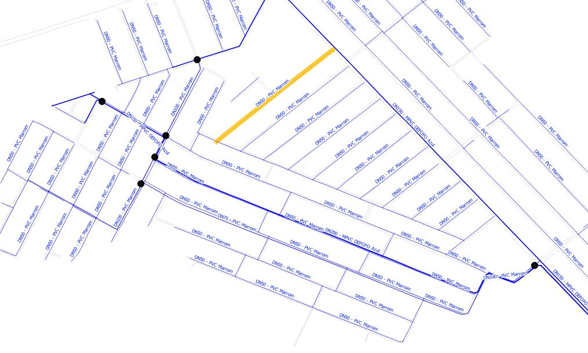
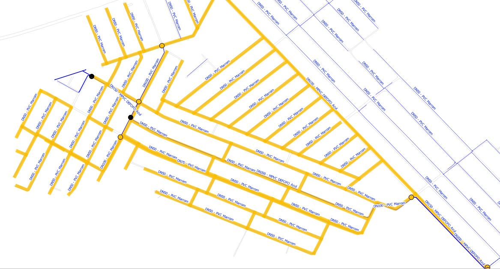

# Tracing Qgis

This plug-in will select all polyline (*pipelines*) segments from a selected line segment, stopping at points (*valves*).
The only data you need to provide is a layer with polyline segments (*pipelines_tracing*), a layer with point segments (*valves_tracing*) and a selected layer feature.

##### pipeline selected

##### Tracing
