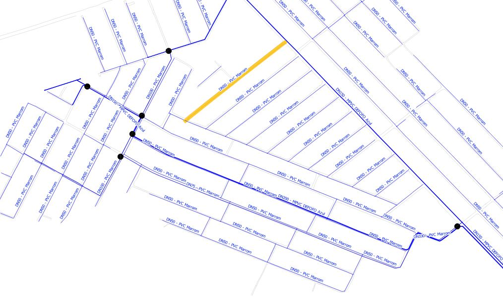
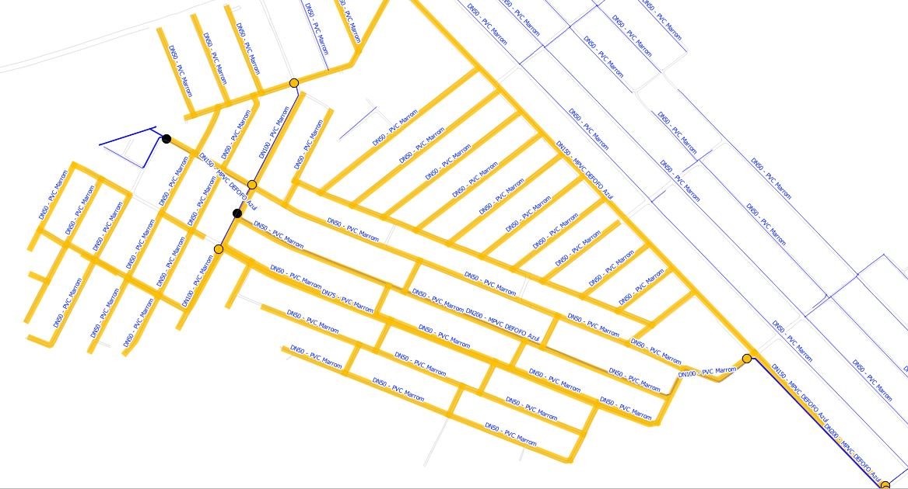

# Tracing QGIS

QGIS plugin that walks a water distribution network to find **which valves must be
closed** to isolate a selected pipe segment.

Starting from one selected pipeline feature, the plugin traverses the connected
network segment by segment. At each pipe endpoint it looks for the nearest valve:

- **visible and open** valve → added to the "valves to close" list, and the traversal
  stops on that branch;
- **already closed** valve (`status_operacao = 1`) → recorded separately, traversal
  stops;
- **not visible / null** valve → recorded separately, and the traversal **continues**
  past it (you can't operate a valve you can't reach).

A downstream heuristic based on nominal diameter (`is_downstream`) prunes branches
that go to smaller-diameter pipes, so the trace follows the supplying mains rather
than every service connection. It does **not** use a hydraulic model or flow
direction.

When it finishes, the traversed pipes and the valves to close are selected on the
map and the valve codes are copied to the clipboard.

> Built for the Águas de Joinville (CAJ) operations team. The plugin UI is in
> Portuguese.

## Screenshots

| Selected pipeline | Result of the trace |
|---|---|
|  |  |

## Requirements

- QGIS **3.16** or newer
- Two vector layers loaded in the project:
  - a **line** layer with the pipe network
  - a **point** layer with the maneuver valves

### Required attribute fields

The plugin reads these fields by name — the trace will fail or give wrong results
if they are missing:

**Pipe network layer**

| Field | Type | Meaning |
|---|---|---|
| `diametro_nominal` | number | Nominal diameter, used by the downstream heuristic |

**Valve layer**

| Field | Type | Meaning |
|---|---|---|
| `visivel` | text | `sim` = visible, `não` = not visible |
| `status_operacao` | text/number | `0` = open, `1` = closed |
| `codigo` | text | Valve identifier, copied to the clipboard |

## Installation

**From a zip**

1. Download this repository as a zip.
2. In QGIS: *Plugins → Manage and Install Plugins → Install from ZIP*.

**Manual**

Clone into your QGIS plugin folder and enable it in the Plugin Manager:

- Linux: `~/.local/share/QGIS/QGIS3/profiles/default/python/plugins/`
- Windows: `%APPDATA%\QGIS\QGIS3\profiles\default\python\plugins\`
- macOS: `~/Library/Application Support/QGIS/QGIS3/profiles/default/python/plugins/`

```bash
git clone https://github.com/Jefersonnnn/tracing_qgis.git
```

## Usage

1. Load the pipe network and valve layers into your project.
2. Click the **Start Tracing** toolbar button (or *Plugins → Tracing plugins*).
3. In the **Configurações** dialog:
   - **Camada de redes** — select the pipe network layer
   - **Camada de Registros** — select the valve layer
   - **Salvar** — persists the choice for the next sessions
4. On the map, select **exactly one** feature of the pipe network (the segment you
   want to isolate).
5. Click **Iniciar**.
6. When the task finishes, the status label shows the result, the traversed pipes
   and the valves to close are selected on the map, and the valve codes are on the
   clipboard (`Ctrl+V`).

## Limitations

- No hydraulic model and no flow direction — branch pruning is purely geometric
  (proximity) plus the nominal-diameter heuristic.
- Field names are fixed (see above); there is no field-mapping UI yet.
- Valve layer must be named so the plugin can resolve it; keep the configuration
  saved.

## Development

```
core/        traversal tasks (QgsTask): tracing_pipelines, find_points, lancamento_ramal
controller/  dialog controller and QSettings persistence
view/        Qt Designer dialog (view/ui/config_dialog.ui)
tracing.py   plugin entry point (initGui / unload)
```

See [PERFORMANCE.md](PERFORMANCE.md) for a performance analysis and the rationale
behind the current implementation.

## License

GNU General Public License v2.0 or later — see [LICENSE](LICENSE).
